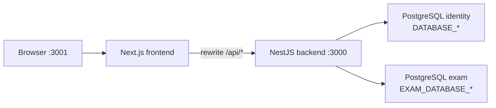

# Nexus

Monorepo com backend API e frontend web para autenticação e consulta de exames.

## Estrutura do repositório

```
test-nexus/
├── nexus-backend-typescripty/   # API NestJS (porta 3000)
├── nexus-frontend/              # App Next.js (porta 3001)
└── README.md
```

## Arquitetura



O frontend faz proxy das requisições `/api/*` para o backend. O backend se conecta a dois bancos PostgreSQL:

- **Identity** — usuários e autenticação JWT (Postgres local via Docker)
- **Exam** — consulta read-only de exames no banco externo `central_teste`

## Pré-requisitos

- Node.js 18+ (recomendado 20+)
- Yarn (backend) e npm (frontend)
- Docker e Docker Compose (Postgres local do backend)
- Credenciais reais do banco de exames (`EXAM_DATABASE_*`) — solicite à equipe responsável

## Quick start

### Terminal 1 — Backend

```bash
cd nexus-backend-typescripty
yarn install
cp .env.default .env
```

Edite o `.env` e preencha as credenciais `EXAM_DATABASE_*` (linhas 13–18 do `.env.default`) com os dados reais do banco de exames, além de um `JWT_SECRET` seguro. Veja detalhes em [Backend README](./nexus-backend-typescripty/README.md#banco-de-exames-exam_database_).

```bash
yarn services:up:database && yarn services:wait:database
yarn identity:db:migrate
yarn start:dev
```

### Terminal 2 — Frontend

```bash
cd nexus-frontend
npm install
npm run dev
```

Acesse **http://localhost:3001**.

## Portas e URLs

| Serviço | URL (desenvolvimento) |
|---------|-----------------------|
| Frontend | http://localhost:3001 |
| Backend API | http://localhost:3000 |
| Postgres local (identity) | localhost:5432 |

## Credenciais do banco de exames

As variáveis `EXAM_DATABASE_*` no `.env` do backend usam placeholders que **não funcionam em desenvolvimento**. Substitua `EXAM_DATABASE_PASSWORD` e demais campos pelas credenciais reais do banco `central_teste` antes de iniciar a API.

Para instruções completas, consulte a seção [Banco de exames](./nexus-backend-typescripty/README.md#banco-de-exames-exam_database_) no README do backend.

## Documentação detalhada

- [Backend README](./nexus-backend-typescripty/README.md) — setup completo, variáveis de ambiente, migrations e endpoints
- [Frontend README](./nexus-frontend/README.md) — setup, integração com a API e estrutura de rotas
